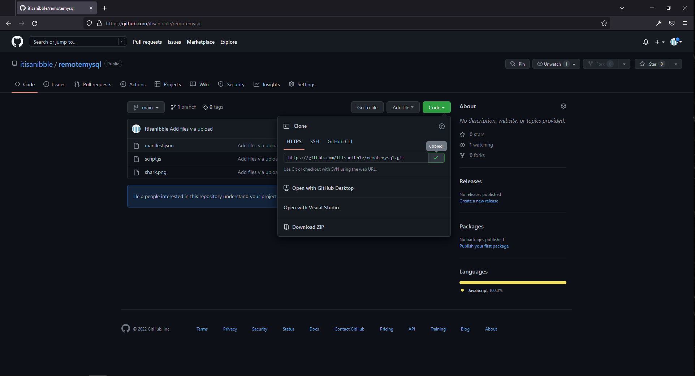
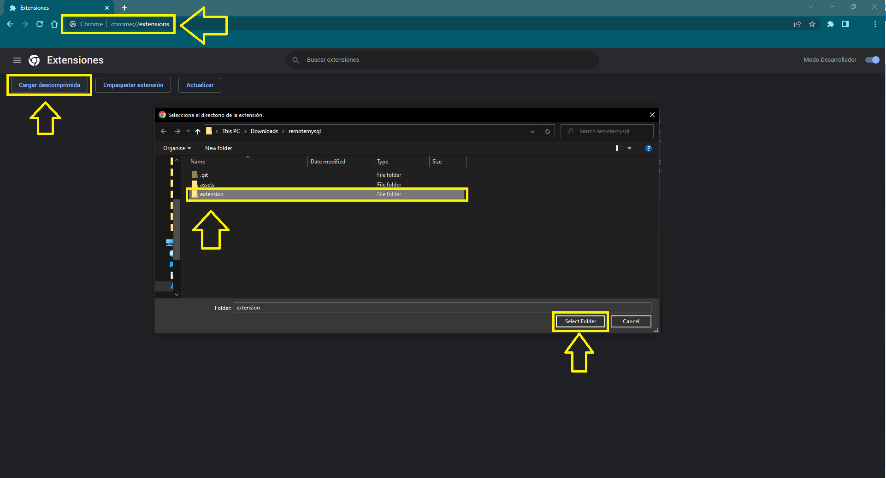
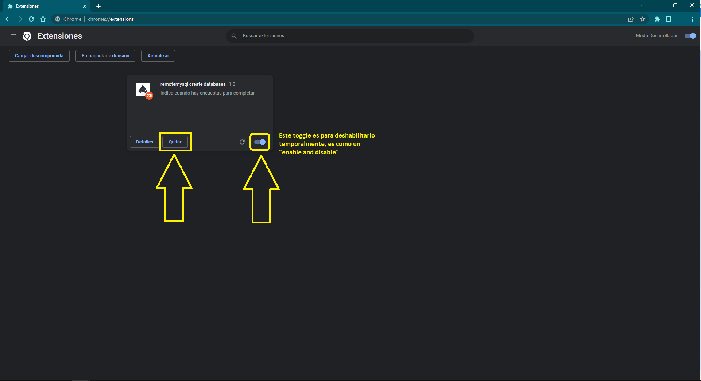

# Antes de instalar algo, lo mejor es saber como desistarlo. Ir abajo de todo **(Imagen 3)**

## Procesos para la instalación

1. Clonar el repositorio **(Imagen 1)**
2. Abrir chrome ir a ***chrome://extensions/*** clickear en "Cargar descomprimida" buscar con el explorador de archivo el repositorio clonado seleccionar la carpeta ***"extension"*** **(Imagen 2)**
3. Entrar a ***https://remotemysql.com/*** logearse y luego ir a la sección ***database*** lo cual sería ***https://remotemysql.com/databases.php*** de ahí en adelante **NO** deberás hacer nada. La página se va a refrescar aútomaticamente, verás que la pestaña estará la leyenda **"Trabajando..."**, no es necesario que estes infocado a esa pestaña, podrías estar trabajando en otra pestaña y seguirá funcionando. El proceso terminara cuando deje de refrescarse la página y en la pestaña veras la leyenda **Termino ...**

> Nota: Solamente la carpeta ***extension*** dentro de la carpeta que se clona que es ***remotemysql***


## Imagen 1

## Imagen 2



# ¿ Cómo funciona ?

En el archivo manifest.json lo único relevante es el **content_scripts**

```json
{
  "name": "remotemysql create databases",
  "description": "Indica cuando hay encuestas para completar",
  "version": "1.0",
  "manifest_version": 3,
  "icons": {"128": "shark.png"},
  "content_scripts": [
    {
      "matches": ["https://wss.pollfish.com/*", "https://remotemysql.com/databases.php"],
      "js": ["script.js"]
    }
  ]
}
```

> content_scripts["js"]  es el script que chrome cargara automáticamente... ¿ y cuándo lo hará ? ... eso lo determina content_scripts["matches"] que indica en que URL debe inyectar el script.js

<br>
<br>

# Desinstalación

## Imagen 3

